@(ZJU)
# MINISQL 

---
*Made By Aaron*    

## 1.总体框架

----
1）总功能：允许用户通过字符界面输入SQL语句实现表的建立/删除；索引的建立/删除以及表记录的插入/删除/查找； 
2） 数据类型：支持三种基本数据类型：INT，CHAR(N)，FLOAT，其中CHAR(N)满足 1 <= N <= 255； 
3）表定义：一个表最多可以定义32个属性，各属性可以指定是否为UNIQUE；支持单属性的主键定义； 
4）索引的建立和删除：对于表的主属性自动建立B+树索引，对于声明为UNIQUE的属性可以通过SQL语句由用户指定建立/删除B+树索引（因此，所有的B+树索引都是单属性单值的）； 
5）查找记录：可以通过指定用AND连接的多个条件进行查询，支持等值查询和区间查询； 
6）插入和删除记录：支持每次一条记录的插入操作；支持每次一条或多条记录的删除操作。

## 2.设计语言与运行环境

---
1）设计语言：C++
2）运行环境：Visual Studio 2017
 
## 3.各模块实现功能

---
1. Interpreter实现功能
   Interpreter模块直接与用户交互，主要实现接收并解释用户输入的命令，检查命令的语法正确性和语义正确性，对正确的命令调用API层提供的函数执行并显示执行结果，对不正确的命令显示错误信息。
2. API实现功能
   API模块是整个系统的核心，其主要功能为提供执行SQL语句的接口，供Interpreter层调用。该接口以Interpreter层解释生成的命令内部表示为输入，根据Catalog Manager提供的信息确定执行规则，并调用Record Manager、Index Manager和Catalog Manager提供的相应接口进行执行，最后返回执行结果给Interpreter模块。
3. Catalog Manager实现功能
   Catalog Manager负责管理数据库的所有模式信息，包括：
   1）数据库中所有表的定义信息，包括表的名称、表中字段（列）数、主键、定义在该表上的索引。
   2）表中每个字段的定义信息，包括字段类型、是否唯一等。
   3）数据库中所有索引的定义，包括所属表、索引建立在那个字段上等。
   Catalog Manager还必需提供访问及操作上述信息的接口，供Interpreter和API模块使用。
4. Record Manager实现功能
   Record Manager负责管理记录表中数据的数据文件。主要功能为实现数据文件的创建与删除（由表的定义与删除引起）、记录的插入、删除与查找操作，并对外提供相应的接口。其中记录的查找操作要求能够支持不带条件的查找和带一个条件的查找（包括等值查找、不等值查找和区间查找）。
5. Index Manager实现功能
   Index Manager负责B+树索引的实现，实现B+树的创建和删除、等值查找、插入键值、删除键值等操作，并对外提供相应的接口。
   B+树中节点大小与缓冲区的块大小相同，B+树的叉数由节点大小与索引键大小计算得到。
6. Buffer Manager实现功能
   Buffer Manager负责缓冲区的管理，主要功能有：
   1）根据需要，读取指定的数据到系统缓冲区或将缓冲区中的数据写出到文件
   2）实现缓冲区的替换算法，当缓冲区满时选择合适的页进行替换
   3）记录缓冲区中各页的状态，如是否被修改过等
   4）提供缓冲区页的pin功能，及锁定缓冲区的页，不允许替换出去
   为提高磁盘I/O操作的效率，缓冲区与文件系统交互的单位是块，块的大小应为文件系统与磁盘交互单位的整数倍。
7. DB Files实现功能 
   DB Files指构成数据库的所有数据文件，主要由记录数据文件、索引数据文件和Catalog数据文件组成。
8. 主函数实现功能
   main函数主要实现程序的初始化，读入标准输入传递给Interpreter模块进行解释执行，并且根据Interpreter的返回值决定下一步的动作，或继续读入指令，或读入文件，或输出帮助信息，或退出程序。在读入传递语句的同时，也会进行时间的计算，用于对MINISQL性能的考量。

## 4.内部接口

---
Interpreter返回字符串给主函数以决定该进行何种输出：
1）	返回为2，进行文件操作；
2）	返回为1，则正常运行程序；
3）	返回为-1，退出程序；
4）	返回为-2，输出帮助信息。
另外，Interpreter会将用户输入无误的操作以及参数传递利用函数传递给API相应函数，API中，则会调用Catalog Manager中的函数对表属性进行管理，调用Record Manager中的函数对表中记录进行管理。在Record Manager和Catalog Manager 中则会从Buffer Manager中调用所需的文件进行操作。Buffer Manager在收到文件请求时，会从DB Files中调取文件放在Buffer中等待调用。Index Manager中，则负责管理index的建立、插入和删除，和记录数据、表格属性等保持一致。
内部数据结构主要包含存储存储各属性信息的Attribute结构，提供查看属性的接口；存储各比较运算符号的Condition结构，提供条件查询的比较接口；B+树索引结构，提供索引操作的接口；存储文件的文件FileNode结构，负责保存Buffer中暂存的各个文件及其内容，供Buffer Manager调用使用。

## 5.系统测试

---
1. 主窗口
   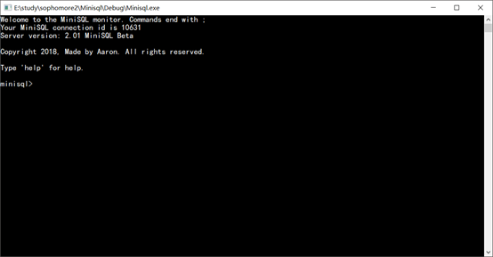
2. 创建表
    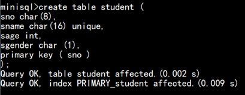
   3.插入数据
    
   4.无索引条件查找
    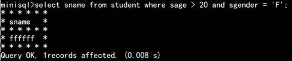
   5.创建索引
   
   6.有索引条件查找
    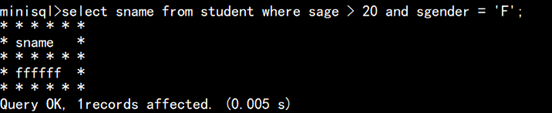
   7.索引插入
    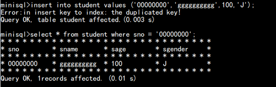
   8.索引删除
    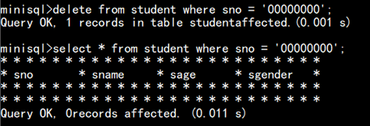
   9.删除索引
    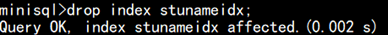
3. 条件删除记录
    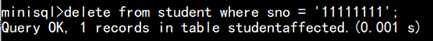
4. 全部删除记录
    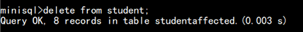
5. 删除表
   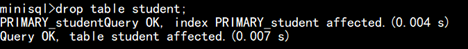
6. 执行文件 
    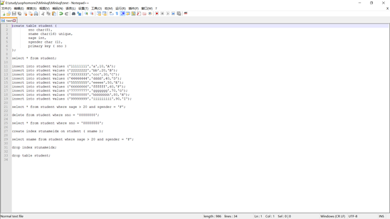
   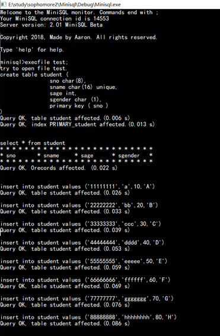
   
7. 帮助
    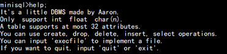
8. 退出
   输入exit; 之后程序退出。
9. 文件
    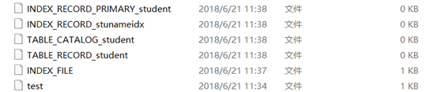
